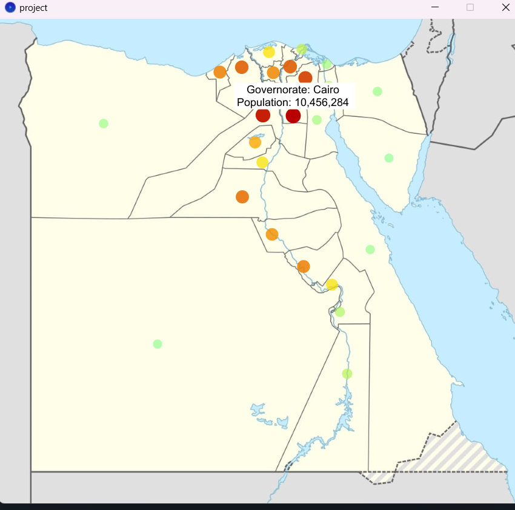

# Population Visualization of Egyptian Governorates

## Project Overview

This project aims to visualize the population distribution across the 27 governorates of Egypt. The visualization is created using data collected from web scraping and is displayed on a map of Egypt.

## Table of Contents

1. [Stages of Visualization](#stages-of-visualization)
2. [Development Environment](#development-environment)
3. [How to Use](#how-to-use)

## Stages of Visualization

### 1. Data Collection
- **Description**: The population data for each governorate is collected using web scraping techniques.
- **Tools Used**: JSoup library.
- **Files Created**: `egypt-pop.tsv` (contains population data) and `location.tsv` (contains map locations).

### 2. Data Processing
- **Description**: The collected data is processed to prepare it for visualization.
- **Data Manipulation**:
  - Clean and structure the population data.
  - Format the data into a suitable structure for visualization.
- **Files Used**: `egypt-pop.tsv`.

### 3. Data Visualization
- **Description**: Visualize the processed data on a map of Egypt.
- **Tools Used**: Processing Development Environment.
- **Visualization Elements**:
  - Display population data for each governorate.
  - Highlight different regions based on population density.

### 4. Map Integration
- **Description**: Integrate the map of Egypt with the visualization.
- **Files Used**: `map.jpg`.
- **Steps**:
  - Load the map data.
  - Overlay the population data on the map.

## Development Environment

- **Environment**: Processing Development Environment (PDE).
- **Libraries Used**:
  - JSoup for web scraping.
  - Processing libraries for visualization and map integration.

## How to Use

1. **Setup**:
   - Ensure you have Processing Development Environment installed.
   - Import necessary libraries (JSoup for data scraping, Processing libraries for visualization).

2. **Data Preparation**:
   - Run the web scraping script using JSoup to collect population data.
   - Save the data in `egypt-pop.tsv` and `map.jpg`.

3. **Visualization**:
   - Open the Processing IDE.
   - Load and run the provided Processing sketch to visualize the population data on the map of Egypt.

4. **View Results**:
   - The visualization will display the population distribution across the 27 governorates of Egypt.
  
## Output
**`When you hover over the mouse, the city name and its population count will appear.`**

  

